```{=html}
<style type="text/css">

body, td {
   font-size: 18px;
}
code.r{
  font-size: 12px;
}
pre {
  font-size: 12px
}
</style>
```


# T-tests

In traditional statistics classes, the t-test—invented by William Gosset while working at the Guinness brewery—is taught for conducting tests on the mean of data or for comparing two sets of data. To illustrate this we continue to use the tips data.


```r
# Load the tips data from directory
tips <- read.csv("E:/broadwaylearning/R-Training/Statistical Analysis in R/tips.csv")
head(tips)
```

```
  total_bill  tip    sex smoker day   time size
1      16.99 1.01 Female     No Sun Dinner    2
2      10.34 1.66   Male     No Sun Dinner    3
3      21.01 3.50   Male     No Sun Dinner    3
4      23.68 3.31   Male     No Sun Dinner    2
5      24.59 3.61 Female     No Sun Dinner    4
6      25.29 4.71   Male     No Sun Dinner    4
```

```r
library(dplyr)
```

```

Attaching package: 'dplyr'
```

```
The following objects are masked from 'package:stats':

    filter, lag
```

```
The following objects are masked from 'package:base':

    intersect, setdiff, setequal, union
```


```r
# sex of the bill payer
unique(tips$sex)
```

```
[1] "Female" "Male"  
```


```r
# Unique day of bills
unique(tips$day)
```

```
[1] "Sun"  "Sat"  "Thur" "Fri" 
```
We have throughly looked into the data set which is necessary to begin with further data analysis.

## One Sample T-test

First we conduct a one-sample t-test on whether the average tip is equal to $2.50. This test essentially calculates the mean of data and builds a confidence interval. If the value we are testing falls within that confidence interval, then we can conclude that it is the true value for the mean of the data; otherwise, we conclude that it is not the true mean.

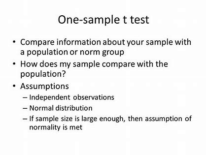

Setting up hypothesis

```r
H0 <- "The true value of average tip is $2.50"

H1 <- "The true value of average tip differs from the $2.50"
```

Carrying out the one sample t-test here to find out if our hypothesis is correct.To conduct the t-test in R we have to use ***t.test()*** function.


```r
t_resutlt<- t.test(tips$tip, alternative = "two.sided",mu = 2.50)
t_resutlt
```

```

	One Sample t-test

data:  tips$tip
t = 5.6253, df = 243, p-value = 5.08e-08
alternative hypothesis: true mean is not equal to 2.5
95 percent confidence interval:
 2.823799 3.172758
sample estimates:
mean of x 
 2.998279 
```

Here, we have to look at the p-value. The p-value is used to decide whether the null hypothesis rejected or not. If the p value is less than 0.05(alpha) then we reject null hypothesis otherwise we fail to reject null hypothesis.

```r
# Now lets write the decision statement.

decision <- ifelse(t_resutlt$p.value < 0.05,H1,H0)
decision
```

```
[1] "The true value of average tip differs from the $2.50"
```

## Two sample T-test

More often than not the t-test is used for comparing two samples. Continuing with the tips data, we compare how female and male diners tip. Before running the t-test, however, we first need to check the variance of each sample. A traditional t-test requires both groups to have the same variance, whereas the Welch two-sample t-test can handle groups with differing variances.

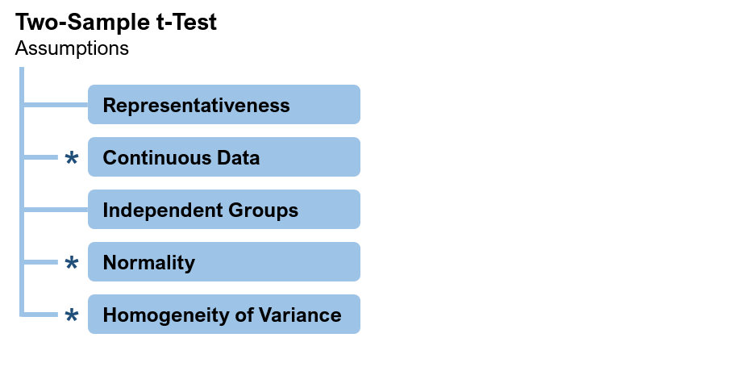
We can explore this both numerically and visually in figure.


```r
library(ggplot2)
ggplot(data = tips,
       mapping = aes(x = tip,fill = sex))+
  geom_histogram(position = 'stack')
```

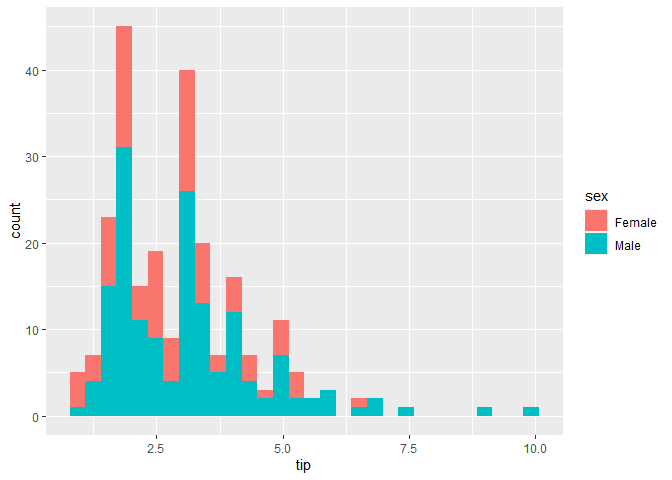

To carry on the two sample t-test first we have to compute the variance for each group. It can be done in either simple computation method or by using variance text methods like, levene test/barttet test.

First simple computation method.

```r
# using aggregate function.
aggregate(tip~sex, data = tips, var)
```

```
     sex      tip
1 Female 1.344428
2   Male 2.217424
```
Here, it does not seem that the variance are equal in two groups but to test them statistically we have to use statistical way. For that we have to check the normality of the data.


```r
# testing normality using shapiro-wilk normality test.
# first normality test of whole tip column
norm_tip <-shapiro.test(tips$tip)
norm_tip
```

```

	Shapiro-Wilk normality test

data:  tips$tip
W = 0.89781, p-value = 8.2e-12
```

```r
H0 = "The data is normal"
H1 = "The data is deviated from normality"
```
Decision


```r
ifelse(norm_tip$p.value < 0.05,H1,H0)
```

```
[1] "The data is deviated from normality"
```


```r
# Secondly testing Normality for Female tip
norm_f <- shapiro.test(tips$tip[tips$sex == "Female"])
norm_f
```

```

	Shapiro-Wilk normality test

data:  tips$tip[tips$sex == "Female"]
W = 0.95678, p-value = 0.005448
```
Decision


```r
ifelse(norm_f$p.value < 0.05,H1,H0)
```

```
[1] "The data is deviated from normality"
```

```r
# Finally testing Normality for Female tip
norm_m <- shapiro.test(tips$tip[tips$sex == "Male"])
norm_m
```

```

	Shapiro-Wilk normality test

data:  tips$tip[tips$sex == "Male"]
W = 0.87587, p-value = 3.708e-10
```
Decision


```r
ifelse(norm_m$p.value < 0.05,H1,H0)
```

```
[1] "The data is deviated from normality"
```
Since the data is not normal. we have to use the non parametric method to examine the difference in variance of these two samples.


```r
# Using Ansari-Bradley test 
var_test <- ansari.test(tip~sex, data = tips)
var_test
```

```

	Ansari-Bradley test

data:  tip by sex
AB = 5582.5, p-value = 0.376
alternative hypothesis: true ratio of scales is not equal to 1
```

```r
H0 = "Variances of two sample are equal"
H1 = "Variances of two sample are different"
```

Decision

```r
ifelse(var_test$p.value < 0.05, H1,H0)
```

```
[1] "Variances of two sample are equal"
```

This test indicates that the variances are equal, meaning we can use the standard two-sample t-test.

**Now two sampleT-test**


```r
test_2 <- t.test(tip~sex, data = tips, var.equal = TRUE)
test_2
```

```

	Two Sample t-test

data:  tip by sex
t = -1.3879, df = 242, p-value = 0.1665
alternative hypothesis: true difference in means between group Female and group Male is not equal to 0
95 percent confidence interval:
 -0.6197558  0.1074167
sample estimates:
mean in group Female   mean in group Male 
            2.833448             3.089618 
```

```r
H0 <- "There is no significant difference in mean of two samples"

H1 <- "Means of two sample are different"
```

Decision

```r
ifelse(test_2$p.value < 0.05,H1,H0)
```

```
[1] "There is no significant difference in mean of two samples"
```
According to this test, the results were not significant, and we should conclude that female and male
diners tip roughly equally. While all this statistical rigor is nice, a simple rule of thumb would be to see if
the two means are within two standard deviations of each other.


```r
# library(dplyr)
# tipSummary <- ddply(tips, "sex", summarize,
#                     tip.mean=mean(tip), tip.sd=sd(tip),
#                     Lower=tip.mean - 2*tip.sd/sqrt(NROW(tip)),
#                     Upper=tip.mean + 2*tip.sd/sqrt(NROW(tip)))
# tipSummary

tip_summary <- tips %>%
  group_by(sex) %>%
  summarize(mean_tip = mean(tip), sd_tip = sd(tip),
            n = n()) %>%
  mutate(Lower = mean_tip - 2 * sd_tip/sqrt(n)) %>%
  mutate(Upper = mean_tip + 2 * sd_tip/sqrt(n))
```

Lets visualize this result 

```r
ggplot(data = tip_summary, 
       mapping = aes(x = mean_tip, y = sex)) +
  geom_point()+
  geom_errorbar(aes(xmin = Lower, xmax = Upper), height = .2)
```

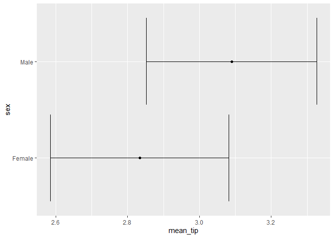


The figure clearly show the confidence intervals overlapping, suggesting that the means for the two sexes are roughly equivalent.

## Paired Two Sample-test

For testing paired data a paired t-test should be used. This is simple enough to do by setting the paired argument in t.test to TRUE. Suppose you want to assess whether a new teaching method has a significant impact on the test scores of a group of students. To do this, you collect test scores from the same group of students before and after they receive the new teaching method.

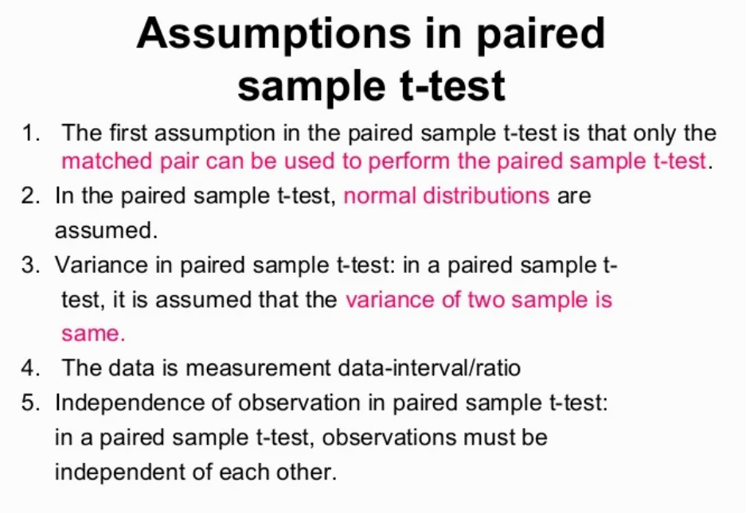
The result of the paired sample t-test will provide you with a p-value, which you can use to make conclusions about the effectiveness of the teaching method in improving the students' test scores.

To illustrate, we use data collected by Karl Pearson on the heights of fathers and sons that is located in the UsingR package. Heights are generally normally distributed, so we will forgo the tests of normality and equal variance.


```r
#install.packages('UsingR')
data(father.son, package = 'UsingR')
head(father.son)
```

```
   fheight  sheight
1 65.04851 59.77827
2 63.25094 63.21404
3 64.95532 63.34242
4 65.75250 62.79238
5 61.13723 64.28113
6 63.02254 64.24221
```

In this data it is stated that the heights are normally distributed and have equal variance if not you can use the same approach to check the normality and variance.


```r
paired <- t.test(father.son$fheight, father.son$sheight, paired = TRUE)
paired
```

```

	Paired t-test

data:  father.son$fheight and father.son$sheight
t = -11.789, df = 1077, p-value < 2.2e-16
alternative hypothesis: true mean difference is not equal to 0
95 percent confidence interval:
 -1.1629160 -0.8310296
sample estimates:
mean difference 
     -0.9969728 
```

```r
H0 = "There is no significant differnce in fathers and sons height"

H1 = "The fathers height are different than sons height"
```

Decision

```r
ifelse(paired$p.value < 0.05, H1, H0)
```

```
[1] "The fathers height are different than sons height"
```

This test shows that we should reject the null hypothesis and conclude that fathers and sons (at least for this dataset) have different heights. We visualize this data using a density plot of the differences, as shown in Figure below. In it we see a distribution with a mean not at zero and a confidence interval that barely excludes zero, which agrees with the test.


```r
# Find the difference in heights
heightDiff <- father.son$fheight - father.son$sheight
# Drawing the plot
ggplot(data = father.son, mapping = aes(x = fheight - sheight)) + geom_density() +
    geom_vline(xintercept = mean(heightDiff)) + geom_vline(xintercept = mean(heightDiff) +
    2 * c(-1, 1) * sd(heightDiff)/sqrt(nrow(father.son)), linetype = 2)
```

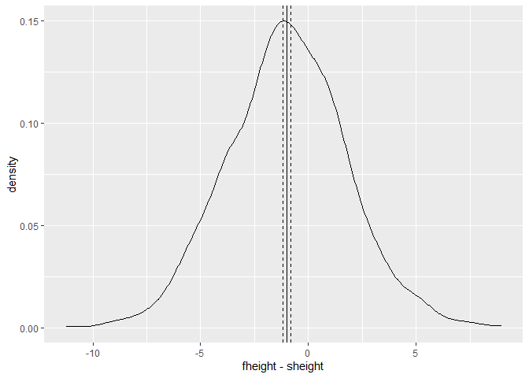

# ANOVA

ANOVA, which stands for Analysis of Variance, is a statistical test used to assess how a numerical outcome (dependent variable) varies across different levels of one or more categorical predictors (independent variables). ANOVA determines whether there are statistically significant differences in the means of groups associated with each level of the predictor(s).

In the ANOVA framework, the null hypothesis (H0) posits that there are no significant differences among the group means, while the alternative hypothesis (Ha) suggests that the means are indeed different from one another.

In this guide, we will take you through the process of conducting a one-way ANOVA (with a single independent variable) and a two-way ANOVA (with two independent variables).

The data we're using for illustration comes from a hypothetical study that examines the impact of various types of fertilizer and planting densities on crop yield.

After comparing two groups, the natural next step is comparing multiple groups. Every year, far too many students in introductory statistics classes are forced to learn the ANOVA (analysis of variance) test and memorize its formula.

$$F = \frac{\sum_i n_i({\overline Y_i }-\overline Y)^2/(K-1)}{\sum_{ij}(Y_{ij}-\overline Y)^2/(N-K)} \tag{i}$$

where $n_i$ is the number of observations in group i, $\overline Y$ is the overall mean, $Y_{ij}$ is observation $j$ in group $i$, $N$ is the total number of observations and $K$ is the number of groups.

Not only is this a laborious formula that often turns off a lot of students from statistics; it is also a bit of an old-fashioned way of comparing groups. Even so, there is an R function—albeit rarely used—to conduct the ANOVA test. This also uses the formula interface where the left side is the variable of interest and the right side contains the variables that control grouping. To see this, we compare tips by day of the week, with levels Fri, Sat, Sun, Thur.


One-way ANOVA example:

In the one-way ANOVA, we test the effects of 3 types of fertilizer on crop yield.

Two-way ANOVA example:

In the two-way ANOVA, we add an additional independent variable: planting density. We test the effects of 3 types of fertilizer and 2 different planting densities on crop yield.

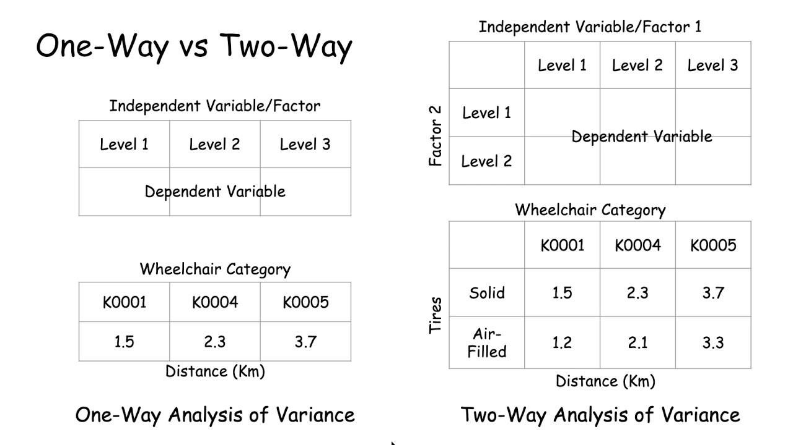


```r
# install required packages (ggplot2, ggpubr,tidyverse,broom,AICmodavg)

#install.packages(c("ggplot2", "ggpubr", "tidyverse", "broom", "AICcmodavg"))

library(ggplot2)
library(ggpubr)
library(tidyverse)
library(broom)
library(AICcmodavg)
```

**Load the data set to perform ANOVA**


```r
# load crop dataset
crop_data <- read.csv("E:/broadwaylearning/R-Training/Statistical Analysis in R/crop.data.csv")

# check the data using summary function.
summary(crop_data)
```

```
    density        block        fertilizer     yield      
 Min.   :1.0   Min.   :1.00   Min.   :1    Min.   :175.4  
 1st Qu.:1.0   1st Qu.:1.75   1st Qu.:1    1st Qu.:176.5  
 Median :1.5   Median :2.50   Median :2    Median :177.1  
 Mean   :1.5   Mean   :2.50   Mean   :2    Mean   :177.0  
 3rd Qu.:2.0   3rd Qu.:3.25   3rd Qu.:3    3rd Qu.:177.4  
 Max.   :2.0   Max.   :4.00   Max.   :3    Max.   :179.1  
```

```r
str(crop_data)
```

```
'data.frame':	96 obs. of  4 variables:
 $ density   : int  1 2 1 2 1 2 1 2 1 2 ...
 $ block     : int  1 2 3 4 1 2 3 4 1 2 ...
 $ fertilizer: int  1 1 1 1 1 1 1 1 1 1 ...
 $ yield     : num  177 178 176 178 177 ...
```

Here we can see the density, block and fertilizer column are stored as numerical (integer) data which has  to be categorical data. So we can change it using this code.


```r
crop_data$density <- as.character(crop_data$density)
crop_data$block <- as.character(crop_data$block)
crop_data$fertilizer <- as.character(crop_data$fertilizer)
summary(crop_data)
```

```
   density             block            fertilizer            yield      
 Length:96          Length:96          Length:96          Min.   :175.4  
 Class :character   Class :character   Class :character   1st Qu.:176.5  
 Mode  :character   Mode  :character   Mode  :character   Median :177.1  
                                                          Mean   :177.0  
                                                          3rd Qu.:177.4  
                                                          Max.   :179.1  
```


ANOVA tests whether any of the group means are different from the overall mean of the data by checking the variance of each individual group against the overall variance of the data. If one or more groups falls outside the range of variation predicted by the null hypothesis (all group means are equal), then the test is statistically significant.

We can perform an ANOVA in R using the aov() function. This will calculate the test statistic for ANOVA and determine whether there is significant variation among the groups formed by the levels of the independent variable.

## One-way ANOVA

In the one-way ANOVA example, we are modeling crop yield as a function of the type of fertilizer used. First we will use aov() to run the model, then we will use summary() to print the summary of the model.

**Setting up hypothesis**

```r
H0 <- "There is no significant effect of fertilizers on crop yields"

H1 <- "Fertilizers have significant effects on crop yield"
```

**Perform one way ANOVA**

```r
one_way <- aov(yield ~ fertilizer, data = crop_data)
summary_anova <- summary(one_way)
summary_anova
```

```
            Df Sum Sq Mean Sq F value Pr(>F)    
fertilizer   2   6.07  3.0340   7.863  7e-04 ***
Residuals   93  35.89  0.3859                   
---
Signif. codes:  0 '***' 0.001 '**' 0.01 '*' 0.05 '.' 0.1 ' ' 1
```
The model summary first lists the independent variables being tested in the model (in this case we have only one, ‘fertilizer’) and the model residuals (‘Residual’). All of the variation that is not explained by the independent variables is called residual variance.

The rest of the values in the output table describe the independent variable and the residuals:

- The Df column displays the degrees of freedom for the independent variable (the number of levels in the variable minus 1), and the degrees of freedom for the residuals (the total number of observations minus one and minus the number of levels in the independent variables).

- The Sum Sq column displays the sum of squares (a.k.a. the total variation between the group means and the overall mean).
The Mean Sq column is the mean of the sum of squares, calculated by dividing the sum of squares by the degrees of freedom for each parameter.

- The F value column is the test statistic from the F test. This is the mean square of each independent variable divided by the mean square of the residuals. The larger the F value, the more likely it is that the variation caused by the independent variable is real and not due to chance.

- The Pr(>F) column is the p value of the F statistic. This shows how likely it is that the F value calculated from the test would have occurred if the null hypothesis of no difference among group means were true.

**P-Vale**


```r
p_value <- summary_anova[[1]]$`Pr(>F)`[1]
p_value
```

```
[1] 0.0006999158
```

**Decision**

The p value of the fertilizer variable is low (p < 0.001), so it appears that the type of fertilizer used has a real impact on the final crop yield.


```r
ifelse(p_value < 0.05, H1, H0)
```

```
[1] "Fertilizers have significant effects on crop yield"
```

## TWo way ANOVA

In the two-way ANOVA example, we are modeling crop yield as a function of type of fertilizer and planting density. First we use aov() to run the model, then we use summary() to print the summary of the model.
**Setting up hypothesis**

```r
H0_fert <- "There is no significant effect of fertilizers on crop yields"

H1_fert <- "Fertilizers have significant effects on crop yield"

H0_dens <- "There is no significant effect of crop density on crop yields"

H1_dens <- "Crop density have significant effects on crop yield"
```

**Perform two way ANOVA**


```r
two_way <- aov(yield ~ fertilizer + density, data = crop_data)
summary_anova1 <- summary(two_way)
summary_anova1
```

```
            Df Sum Sq Mean Sq F value   Pr(>F)    
fertilizer   2  6.068   3.034   9.073 0.000253 ***
density      1  5.122   5.122  15.316 0.000174 ***
Residuals   92 30.765   0.334                     
---
Signif. codes:  0 '***' 0.001 '**' 0.01 '*' 0.05 '.' 0.1 ' ' 1
```

**P_Value**

```r
p_value_fertilizer <- summary_anova1[[1]]$`Pr(>F)`[1]
p_value_density <- summary_anova1[[1]]$`Pr(>F)`[2]
p_value_fertilizer
```

```
[1] 0.0002532992
```

```r
p_value_density
```

```
[1] 0.0001741418
```
**Decision**
Adding planting density to the model seems to have made the model better: it reduced the residual variance (the residual sum of squares went from 35.89 to 30.765), and both planting density and fertilizer are statistically significant (p-values < 0.001).


```r
ifelse(p_value_fertilizer < 0.05, H1_fert, H0_fert)
```

```
[1] "Fertilizers have significant effects on crop yield"
```

```r
ifelse(p_value_density < 0.05, H1_dens, H0_dens)
```

```
[1] "Crop density have significant effects on crop yield"
```

**Adding interactions between variables**
Sometimes you have reason to think that two of your independent variables have an interaction effect rather than an additive effect.

For example, in our crop yield experiment, it is possible that planting density affects the plants’ ability to take up fertilizer. This might influence the effect of fertilizer type in a way that isn’t accounted for in the two-way model.

To test whether two variables have an interaction effect in ANOVA, simply use an asterisk instead of a plus-sign in the model:


```r
interaction <- aov(yield ~ fertilizer * density, data = crop_data)
summary(interaction)
```

```
                   Df Sum Sq Mean Sq F value   Pr(>F)    
fertilizer          2  6.068   3.034   9.001 0.000273 ***
density             1  5.122   5.122  15.195 0.000186 ***
fertilizer:density  2  0.428   0.214   0.635 0.532500    
Residuals          90 30.337   0.337                     
---
Signif. codes:  0 '***' 0.001 '**' 0.01 '*' 0.05 '.' 0.1 ' ' 1
```

In the output table, the ‘fertilizer:density’ variable has a low sum-of-squares value and a high p value, which means there is not much variation that can be explained by the interaction between fertilizer and planting density.

**Adding a blocking variable**

If you have grouped your experimental treatments in some way, or if you have a confounding variable that might affect the relationship you are interested in testing, you should include that element in the model as a blocking variable. The simplest way to do this is just to add the variable into the model with a ‘+’.

For example, in many crop yield studies, treatments are applied within ‘blocks’ in the field that may differ in soil texture, moisture, sunlight, etc. To control for the effect of differences among planting blocks we add a third term, ‘block’, to our ANOVA.


```r
three_var <- aov(yield ~ fertilizer + density + block, data = crop_data)

summary(three_var)
```

```
            Df Sum Sq Mean Sq F value   Pr(>F)    
fertilizer   2  6.068   3.034   9.018 0.000269 ***
density      1  5.122   5.122  15.224 0.000184 ***
block        2  0.486   0.243   0.723 0.488329    
Residuals   90 30.278   0.336                     
---
Signif. codes:  0 '***' 0.001 '**' 0.01 '*' 0.05 '.' 0.1 ' ' 1
```

The ‘block’ variable has a low sum-of-squares value (0.486) and a high p value (p = 0.48), so it’s probably not adding much information to the model. It also doesn’t change the sum of squares for the two independent variables, which means that it’s not affecting how much variation in the dependent variable they explain.

**Find the best fit model**

There are now four different ANOVA models to explain the data. How do you decide which one to use? Usually you’ll want to use the ‘best-fit’ model – the model that best explains the variation in the dependent variable.

The Akaike information criterion (AIC) is a good test for model fit. AIC calculates the information value of each model by balancing the variation explained against the number of parameters used.

In AIC model selection, we compare the information value of each model and choose the one with the lowest AIC value (a lower number means more information explained!)


```r
library(AICcmodavg)

model.set <- list(one_way,two_way, interaction,three_var)
model.names <- c("One way", "Two way", "Interaction", "With Blocking")

aictab(model.set, modnames = model.names)
```

```

Model selection based on AICc:

              K   AICc Delta_AICc AICcWt Cum.Wt     LL
Two way       5 173.86       0.00   0.71   0.71 -81.59
With Blocking 7 176.93       3.08   0.15   0.86 -80.83
Interaction   7 177.12       3.26   0.14   1.00 -80.92
One way       4 186.41      12.56   0.00   1.00 -88.99
```

The model with the lowest AIC score (listed first in the table) is the best fit for the data:

From these results, it appears that the two.way model is the best fit. The two-way model has the lowest AIC value, and 71% of the AIC weight, which means that it explains 71% of the total variation in the dependent variable that can be explained by the full set of models.

The model with blocking term contains an additional 15% of the AIC weight, but because it is more than 2 delta-AIC worse than the best model, it probably isn’t good enough to include in your results.


## Do a post-hoc test

ANOVA tells us if there are differences among group means, but not what the differences are. To find out which groups are statistically different from one another, you can perform a Tukey’s Honestly Significant Difference (Tukey’s HSD) post-hoc test for pairwise comparisons:


```r
tukey.two_way <- TukeyHSD(two_way)
tukey.two_way
```

```
  Tukey multiple comparisons of means
    95% family-wise confidence level

Fit: aov(formula = yield ~ fertilizer + density, data = crop_data)

$fertilizer
         diff         lwr       upr     p adj
2-1 0.1761687 -0.16822506 0.5205625 0.4452958
3-1 0.5991256  0.25473179 0.9435194 0.0002219
3-2 0.4229569  0.07856306 0.7673506 0.0119381

$density
        diff       lwr       upr     p adj
2-1 0.461956 0.2275204 0.6963916 0.0001741
```

From the post-hoc test results, we see that there are statistically significant differences (p < 0.05) between fertilizer groups 3 and 1 and between fertilizer types 3 and 2, but the difference between fertilizer groups 2 and 1 is not statistically significant. There is also a significant difference between the two different levels of planting density.

# Non-Parametric Tests

## kruskal Wallis Test
The Kruskal-Wallis test in the R programming language is a non-parametric statistical test. It shares similarities with the Mann-Whitney U test but is specifically designed for one-way data analysis with more than two groups. This test allows you to determine if there are significant differences among multiple groups when the data does not meet the assumptions of parametric tests, such as the one-way ANOVA.

The Kruskal-Wallis test is an extension of the Wilcoxon rank-sum test, which is used for comparing two independent samples. With the Kruskal-Wallis test, you can assess whether multiple independent groups, often referred to as "samples," have similar population distributions. This test doesn't make any assumptions about the data following a normal distribution, making it a valuable tool when dealing with non-normally distributed data.

In R, performing a Kruskal-Wallis test is straightforward, and it provides a robust method for evaluating differences among groups without relying on parametric assumptions.

**Assumptions for the Kruskal-Wallis test in R**

The variables should have:

- One independent variable with two or more levels. The test is more commonly used when there are three or more levels. For two levels instead of the Kruskal-Wallis test consider using the Mann Whitney U Test.

- The dependent variable should be the Ordinal scale, Ratio Scale, or Interval scale.

- The observations should be independent. In other words, there should be no correlation between the members in every group or within groups.

- All groups should have identical shape distributions.

**Implementation in R**

R provides a method kruskal.test() which is available in the stats package to perform a Kruskal-Wallis rank sum test.

**Example:**

Let’s use the built-in R data set named PlantGrowth. It contains the weight of plants obtained under control and two different treatment conditions. 


```r
# Preparing the dataset\
# to perform Kruskal-wallis Test
mydat <- PlantGrowth
unique(mydat$group)
```

```
[1] ctrl trt1 trt2
Levels: ctrl trt1 trt2
```

```r
print("Summary of the weight data")
```

```
[1] "Summary of the weight data"
```

```r
summary(mydat$weight)
```

```
   Min. 1st Qu.  Median    Mean 3rd Qu.    Max. 
  3.590   4.550   5.155   5.073   5.530   6.310 
```

Here the column “group” is called factor and the different categories (“ctr”, “trt1”, “trt2”) are named factor levels. The levels are ordered alphabetically. The problem statement is we want to know if there is any significant difference between the average weights of plants in the 3 experimental conditions. And the test can be performed using the function kruskal.test() as given below.

**Setting up Hypothesis**


```r
H0 <- "There is significant difference between the treatment groups"

H1 <- "There are significant difference between the treatment groups"
```


```r
# Krushkal-wallis test
mydat <- PlantGrowth

# Performing krsuhkal-Wallis test
result <- kruskal.test(weight ~ group,
                       data = mydat)
print(result)
```

```

	Kruskal-Wallis rank sum test

data:  weight by group
Kruskal-Wallis chi-squared = 7.9882, df = 2, p-value = 0.01842
```

**Decision:**


```r
ifelse(result$p.value < 0.05, H1, H0)
```

```
[1] "There are significant difference between the treatment groups"
```

**Perform the post hoc analysis**

We use dunn-test as a post hoc analysis. The Dunn test is a post hoc analysis commonly used in conjunction with the Kruskal-Wallis test in R to determine which specific groups are significantly different from each other when dealing with non-normally distributed data. After performing a Kruskal-Wallis test to assess whether there are differences among multiple independent groups, the Dunn test allows for pairwise comparisons. It calculates adjusted p-values, often using methods like the Bonferroni correction, to account for multiple testing. The results from the Dunn test provide valuable insights into which particular group comparisons are statistically significant, helping researchers make precise inferences about differences among the groups while avoiding parametric assumptions. This makes the Dunn test a robust and versatile tool for non-parametric data analysis in R.


```r
# install the dunn.test package
# install.packages("dunn.test")

# load the library

library(dunn.test)

# Perform a post hoc analysis using the Dunn test
posthoc = dunn.test(mydat$weight, mydat$group, method = "bonferroni")
```

```
  Kruskal-Wallis rank sum test

data: x and group
Kruskal-Wallis chi-squared = 7.9882, df = 2, p-value = 0.02

                           Comparison of x by group                            
                                 (Bonferroni)                                  
Col Mean-|
Row Mean |       ctrl       trt1
---------+----------------------
    trt1 |   1.117725
         |     0.3955
         |
    trt2 |  -1.689289  -2.807015
         |     0.1367    0.0075*

alpha = 0.05
Reject Ho if p <= alpha/2
```

```r
# View the post hoc test results
print(posthoc)
```

```
$chi2
[1] 7.988229

$Z
[1]  1.117725 -1.689290 -2.807015

$P
[1] 0.131842134 0.045581972 0.002500145

$P.adjusted
[1] 0.395526402 0.136745916 0.007500436

$comparisons
[1] "ctrl - trt1" "ctrl - trt2" "trt1 - trt2"
```


# Chi-Squared Test

**Introduction**

Sometimes we have to analyse the relationships between two categorical variables. In categorical variables it is difficult ti compare the means, medians or variances. So that It could be difficult to understand the distribution of categorical variables.Thus the chi-squared test is required.

The chi-square test of independence evaluates whether there is an association between the categories of the two variables. There are basically two types of random variables and they yield two types of data: numerical and categorical. Chi-square statistics is used to investigate whether distributions of categorical variables differ from one another. Chi-square test is also useful while comparing the tallies or counts of categorical responses between two(or more) independent groups.

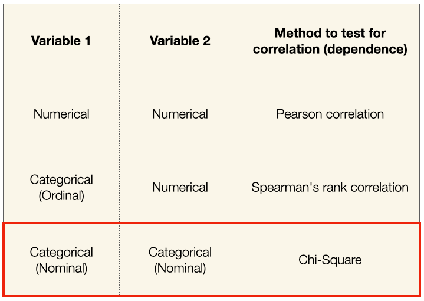

In R, the function used for performing a chi-square test is ***chisq.test()***.

Example
We will take the survey data in the MASS library which represents the data from a survey conducted on students.


```r
# load the MASS package 
library(MASS)		 
```

```

Attaching package: 'MASS'
```

```
The following object is masked from 'package:dplyr':

    select
```

```r
print(str(survey)) 
```

```
'data.frame':	237 obs. of  12 variables:
 $ Sex   : Factor w/ 2 levels "Female","Male": 1 2 2 2 2 1 2 1 2 2 ...
 $ Wr.Hnd: num  18.5 19.5 18 18.8 20 18 17.7 17 20 18.5 ...
 $ NW.Hnd: num  18 20.5 13.3 18.9 20 17.7 17.7 17.3 19.5 18.5 ...
 $ W.Hnd : Factor w/ 2 levels "Left","Right": 2 1 2 2 2 2 2 2 2 2 ...
 $ Fold  : Factor w/ 3 levels "L on R","Neither",..: 3 3 1 3 2 1 1 3 3 3 ...
 $ Pulse : int  92 104 87 NA 35 64 83 74 72 90 ...
 $ Clap  : Factor w/ 3 levels "Left","Neither",..: 1 1 2 2 3 3 3 3 3 3 ...
 $ Exer  : Factor w/ 3 levels "Freq","None",..: 3 2 2 2 3 3 1 1 3 3 ...
 $ Smoke : Factor w/ 4 levels "Heavy","Never",..: 2 4 3 2 2 2 2 2 2 2 ...
 $ Height: num  173 178 NA 160 165 ...
 $ M.I   : Factor w/ 2 levels "Imperial","Metric": 2 1 NA 2 2 1 1 2 2 2 ...
 $ Age   : num  18.2 17.6 16.9 20.3 23.7 ...
NULL
```

The above result shows the dataset has many Factor variables which can be considered as categorical variables. For our model, we will consider the variables “Exer” and “Smoke“.The Smoke column records the students smoking habits while the Exer column records their exercise level. Our aim is to test the hypothesis whether the students smoking habit is independent of their exercise level at .05 significance level.


```r
# Create a data frame from the main data set. 
stu_data = data.frame(survey$Smoke,survey$Exer) 

# Create a contingency table with the needed variables.		 
stu_data = table(survey$Smoke,survey$Exer) 
				
print(stu_data) 
```

```
       
        Freq None Some
  Heavy    7    1    3
  Never   87   18   84
  Occas   12    3    4
  Regul    9    1    7
```

And finally we apply the chisq.test() function to the contingency table stu_data.

**Setting up hypothesis**


```r
# Null Hypothesis
H0 = "The smoking behaviour and excercise level are independent of each other"

# Alternative Hypothesis
H1 = "there is a significant relationship between the smoking behaviour and excercise level of the student"
```

**Conduct Chi-square test**


```r
chi_square <- chisq.test(stu_data)
chi_square
```

```

	Pearson's Chi-squared test

data:  stu_data
X-squared = 5.4885, df = 6, p-value = 0.4828
```
**P Value Extraction**

```r
p_value <- chi_square$p.value
p_value
```

```
[1] 0.4828422
```

**Decision**


```r
ifelse(p_value < 0.05, H1, H0)
```

```
[1] "The smoking behaviour and excercise level are independent of each other"
```

# Correlation

There are different methods to perform correlation analysis:

## **Pearson Correlation (r)**

This measures a linear dependence between two variables (x and y). It’s also known as a parametric correlation test because it depends to the distribution of the data. It can be used only when x and y are from normal distribution. The plot of $y = f(x)$ is named the linear regression curve. The Pearson correlation formula is:

$$ r = \frac{\sum(x-m_x)(y-m_y)}{\sqrt{\sum (x-m_x)^2 \sum (y-y_m)^2}}$$
where $m_x$ and $m_y$ are means of the distributions $x$ and $y$ respectively.

## **Spearman rho**

These are rank-based correlation coefficients (non parametric).The Spearman correlation method computes the correlation between the rank of x and the rank of y variables.

$$rho = \frac{\sum (x-m_x)(y-m_y)}{\sqrt{\sum(x-m_x)^2-(y-y_m)^2}}$$
where $x$ = rank(x) and y = rank(y)

**R method to find correlation coefficient**

Correlation coefficient can be computed using the functions cor() or cor.test():

Load data for correlation analysis. Lets use mtcars data from R base.


```r
my_data <- mtcars
str(my_data)
```

```
'data.frame':	32 obs. of  11 variables:
 $ mpg : num  21 21 22.8 21.4 18.7 18.1 14.3 24.4 22.8 19.2 ...
 $ cyl : num  6 6 4 6 8 6 8 4 4 6 ...
 $ disp: num  160 160 108 258 360 ...
 $ hp  : num  110 110 93 110 175 105 245 62 95 123 ...
 $ drat: num  3.9 3.9 3.85 3.08 3.15 2.76 3.21 3.69 3.92 3.92 ...
 $ wt  : num  2.62 2.88 2.32 3.21 3.44 ...
 $ qsec: num  16.5 17 18.6 19.4 17 ...
 $ vs  : num  0 0 1 1 0 1 0 1 1 1 ...
 $ am  : num  1 1 1 0 0 0 0 0 0 0 ...
 $ gear: num  4 4 4 3 3 3 3 4 4 4 ...
 $ carb: num  4 4 1 1 2 1 4 2 2 4 ...
```

**Pearsons r correlation**


```r
result <- cor.test(my_data$mpg, my_data$wt, method = "pearson")
result
```

```

	Pearson's product-moment correlation

data:  my_data$mpg and my_data$wt
t = -9.559, df = 30, p-value = 1.294e-10
alternative hypothesis: true correlation is not equal to 0
95 percent confidence interval:
 -0.9338264 -0.7440872
sample estimates:
       cor 
-0.8676594 
```

```r
result$estimate
```

```
       cor 
-0.8676594 
```

Here we can see the p value is less than 0.05. So that we reject null hypothesis i.e., There is a significant correlation between mpg and wt of the car.Also, we can see the negative r i.e. -0.8676594 which concludes that there is a negative strong correlation between these two variables.

We can also look at the correlation of each and every continuous variable in the dataset by using this code.


```r
library(psych)
```

```

Attaching package: 'psych'
```

```
The following objects are masked from 'package:ggplot2':

    %+%, alpha
```

```r
pairs.panels(my_data[,c(1,2,6:8)])
```

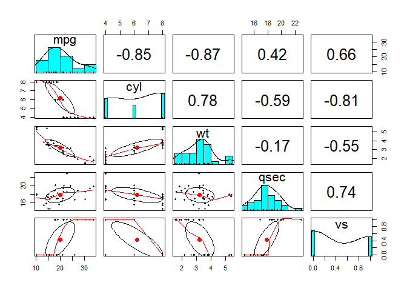<!-- -->

**Spearman rho correlation**


```r
result <- cor.test(my_data$mpg, my_data$wt, method = "spearman")
```

```
Warning in cor.test.default(my_data$mpg, my_data$wt, method = "spearman"):
Cannot compute exact p-value with ties
```

```r
result
```

```

	Spearman's rank correlation rho

data:  my_data$mpg and my_data$wt
S = 10292, p-value = 1.488e-11
alternative hypothesis: true rho is not equal to 0
sample estimates:
      rho 
-0.886422 
```

```r
result$estimate
```

```
      rho 
-0.886422 
```
**Kendall tau**

```r
result <- cor.test(my_data$mpg, my_data$wt, method = "kendall")
result
```

```

	Kendall's rank correlation tau

data:  my_data$mpg and my_data$wt
z = -5.7981, p-value = 6.706e-09
alternative hypothesis: true tau is not equal to 0
sample estimates:
       tau 
-0.7278321 
```

```r
result$estimate
```

```
       tau 
-0.7278321 
```

# Linear Regression
Linear regression is a regression model that uses a straight line to describe the relationship between variables. It finds the line of best fit through your data by searching for the value of the regression coefficient(s) that minimizes the total error of the model.

There are two main types of linear regression:

- Simple linear regression uses only one independent variable

- Multiple linear regression uses two or more independent variables

Here we use data sets i.e., income data set for simple linear regression and heart data set for multiple linear regression. Both of the dataset is available in the related folder.

***Simple linear regression***

The first dataset contains observations about income (in a range of $15k to $75k) and happiness (rated on a scale of 1 to 10) in an imaginary sample of 500 people. The income values are divided by 10,000 to make the income data match the scale of the happiness scores (so a value of $2 represents $20,000, $3 is $30,000, etc.)

***Multiple linear regression***

The second dataset contains observations on the percentage of people biking to work each day, the percentage of people smoking, and the percentage of people with heart disease in an imaginary sample of 500 towns.

## Install required package (baseR)


```r
# This action is required if only the device do not have these packages installed.
# install.packages("ggplot2")
# install.packages("dplyr")
# install.packages("broom")
# install.packages("ggpubr")
```

## Load those package

```r
# We can use the library "pacman" which is a package manager so that we can load several packages at once.
# install.packages("pacman")
pacman::p_load(ggplot2, dplyr, broom, ggpubr)
```
## Simple Linear Regression
### Load the data set and overview them

```r
# Load the income data set for simple linear regression
income_dat <- read.csv("E:/broadwaylearning/R-Training/Statistical Analysis in R/income.data.csv")
# Change this directory if your data is in different location.

# Check the summary of the data here.
summary(income_dat)
```

```
       X             income        happiness    
 Min.   :  1.0   Min.   :1.506   Min.   :0.266  
 1st Qu.:125.2   1st Qu.:3.006   1st Qu.:2.266  
 Median :249.5   Median :4.424   Median :3.473  
 Mean   :249.5   Mean   :4.467   Mean   :3.393  
 3rd Qu.:373.8   3rd Qu.:5.992   3rd Qu.:4.503  
 Max.   :498.0   Max.   :7.482   Max.   :6.863  
```

Here, in this data set you can see the variable income and happiness as two variables. By the use of simple linear regression we can see the relation between these variables.

### Check if it meets the assumptions

1. Independence of the observations.
This should be known to the domain expert / data analyst. Otherwise, consult to the data source. If not you can use several techniques to find the multicolinearity between the independent variables too.

2. Normality of dependent variable.

To check the distribution of the data simply use the ***his()*** function.


```r
hist(income_dat$happiness)
```

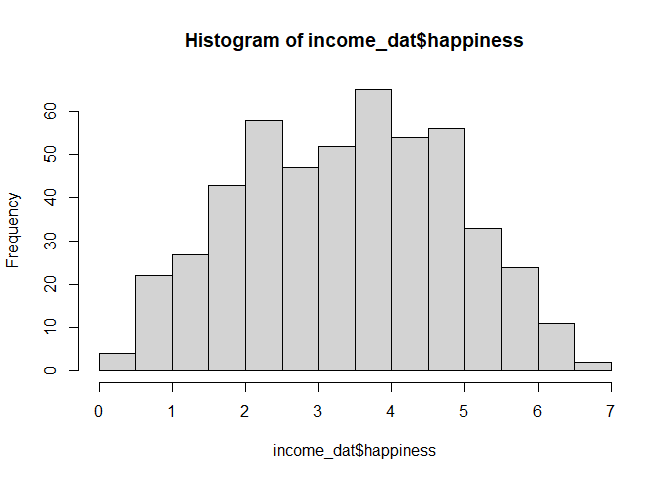<!-- -->
The observations are roughly bell-shaped (more observations in the middle of the distribution, fewer on the tails), so we can proceed with the linear regression.

3. Linearity

The relationship between the independent and dependent variable must be linear. We can test this visually with a scatter plot to see if the distribution of data points could be described with a straight line.


```r
plot(happiness ~ income, data = income_dat)
```

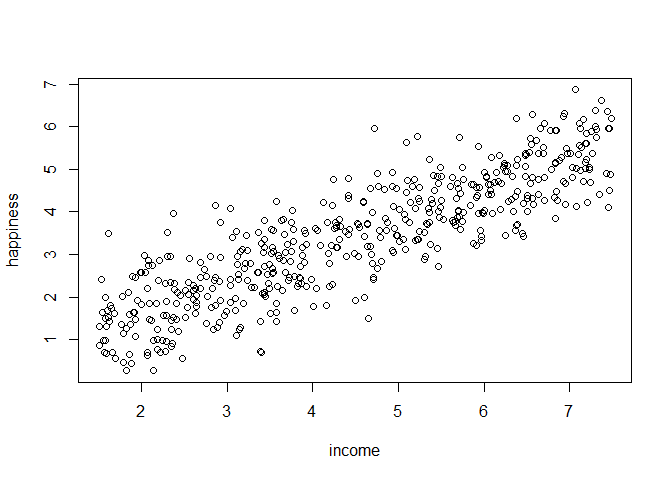<!-- -->

The relationship looks roughly linear, so we can proceed with the linear model.

4. Homoscedasticity (aka homogeneity of variance)

This means that the prediction error doesn’t change significantly over the range of prediction of the model. We can test this assumption later, after fitting the linear model.

### Perform the simple linear regression analysis.

Now that you’ve determined your data meet the assumptions, you can perform a linear regression analysis to evaluate the relationship between the independent and dependent variables.

Let’s see if there’s a linear relationship between income and happiness in our survey of 500 people.

To perform a simple linear regression analysis and check the results, you need to run two lines of code. The first line of code makes the linear model, and the second line prints out the summary of the model:


```r
# Make the model first
income.happiness.lm <- lm(happiness ~ income, data = income_dat)

# Summary of the model
summary(income.happiness.lm)
```

```

Call:
lm(formula = happiness ~ income, data = income_dat)

Residuals:
     Min       1Q   Median       3Q      Max 
-2.02479 -0.48526  0.04078  0.45898  2.37805 

Coefficients:
            Estimate Std. Error t value Pr(>|t|)    
(Intercept)  0.20427    0.08884   2.299   0.0219 *  
income       0.71383    0.01854  38.505   <2e-16 ***
---
Signif. codes:  0 '***' 0.001 '**' 0.01 '*' 0.05 '.' 0.1 ' ' 1

Residual standard error: 0.7181 on 496 degrees of freedom
Multiple R-squared:  0.7493,	Adjusted R-squared:  0.7488 
F-statistic:  1483 on 1 and 496 DF,  p-value: < 2.2e-16
```

This output table first presents the model equation, then summarizes the model residuals.

The Coefficients section shows:

- The estimates (Estimate) for the model parameters – the value of the y-intercept (in this case 0.204) and the estimated effect of income on happiness (0.713).

- The standard error of the estimated values (Std. Error).

- The test statistic (t value, in this case the t statistic).

- The p value (Pr(>| t | )), aka the probability of finding the given t statistic if the null hypothesis of no relationship were true.

The final three lines are model diagnostics – the most important thing to note is the p value (here it is 2.2e-16, or almost zero), which will indicate whether the model fits the data well.

From these results, we can say that there is a significant positive relationship between income and happiness (p value < 0.001), with a 0.713-unit (+/- 0.01) increase in happiness for every unit increase in income.

### Check for homoscedasticity

Before proceeding with data visualization, we should make sure that our models fit the homoscedasticity assumption of the linear model.


```r
par(mfrow = c(2,2))
plot(income.happiness.lm)
```

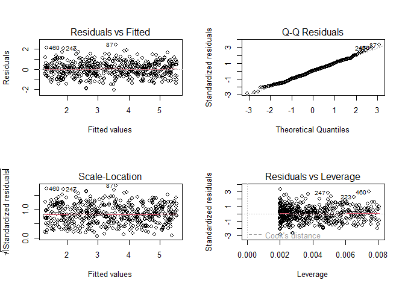<!-- -->

```r
par(mfrow = c(1,1))

# Note that the par(mfrow()) command will divide the Plots 
#window into the number of rows and columns specified in 
#the brackets. So par(mfrow=c(2,2)) divides it up into 
#two rows and two columns. To go back to plotting 
#one graph in the entire window, set the parameters 
#again and replace the (2,2) with (1,1).
```
Residuals are the unexplained variance. They are not exactly the same as model error, but they are calculated from it, so seeing a bias in the residuals would also indicate a bias in the error.

The most important thing to look for is that the red lines representing the mean of the residuals are all basically horizontal and centered around zero. This means there are no outliers or biases in the data that would make a linear regression invalid.

In the Normal Q-Qplot in the top right, we can see that the real residuals from our model form an almost perfectly one-to-one line with the theoretical residuals from a perfect model.

Based on these residuals, we can say that our model meets the assumption of homoscedasticity.

### Model Performance
We can use one package where you can access the reports of the model.

```r
#install.packages("easystats")
library(easystats)
performance(income.happiness.lm)
```

```
# Indices of model performance

AIC      |     AICc |      BIC |    R2 | R2 (adj.) |  RMSE | Sigma
------------------------------------------------------------------
1087.438 | 1087.486 | 1100.069 | 0.749 |     0.749 | 0.717 | 0.718
```


```r
# Report of model
report(income.happiness.lm)
```

```
We fitted a linear model (estimated using OLS) to predict happiness with income
(formula: happiness ~ income). The model explains a statistically significant
and substantial proportion of variance (R2 = 0.75, F(1, 496) = 1482.63, p <
.001, adj. R2 = 0.75). The model's intercept, corresponding to income = 0, is
at 0.20 (95% CI [0.03, 0.38], t(496) = 2.30, p = 0.022). Within this model:

  - The effect of income is statistically significant and positive (beta = 0.71,
95% CI [0.68, 0.75], t(496) = 38.50, p < .001; Std. beta = 0.87, 95% CI [0.82,
0.91])

Standardized parameters were obtained by fitting the model on a standardized
version of the dataset. 95% Confidence Intervals (CIs) and p-values were
computed using a Wald t-distribution approximation.
```

### Visualize the results with a graph


```r
ggplot(data = income_dat,
                       mapping = aes(x = income, y = happiness))+
  geom_point() + # make a point graph 
  geom_smooth(method = 'lm', col = "black") + # Add the regression line
  stat_regline_equation(label.x = 3, label.y = 7) + # Add the regression Line on the figure
  theme_bw() +
  labs(title = "Reported happiness as a function of income",
       x = "Income(x$10,000)",
       y = "Happiness score (0 to 10)") # Here it is ready for publication
```

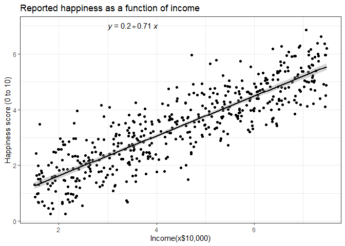<!-- -->

## Multiple Linear Regression

### Load the data set 

```r
heart_dat <- read.csv("E:/broadwaylearning/R-Training/Statistical Analysis in R/heart.data.csv")

# Summary of the data set

summary(heart_dat)
```

```
       X             biking          smoking        heart.disease    
 Min.   :  1.0   Min.   : 1.119   Min.   : 0.5259   Min.   : 0.5519  
 1st Qu.:125.2   1st Qu.:20.205   1st Qu.: 8.2798   1st Qu.: 6.5137  
 Median :249.5   Median :35.824   Median :15.8146   Median :10.3853  
 Mean   :249.5   Mean   :37.788   Mean   :15.4350   Mean   :10.1745  
 3rd Qu.:373.8   3rd Qu.:57.853   3rd Qu.:22.5689   3rd Qu.:13.7240  
 Max.   :498.0   Max.   :74.907   Max.   :29.9467   Max.   :20.4535  
```

### Check if it meets the assumptions

1. Independence of observations (aka no autocorrelation)
Use the *cor()* function to test the relationship between your independent variables and make sure they aren’t too highly correlated.


```r
cor(heart_dat$biking, heart_dat$smoking)
```

```
[1] 0.01513618
```
When we run this code, the output is 0.015. The correlation between biking and smoking is small (0.015 is only a 1.5% correlation), so we can include both parameters in our model.

2. Normality

Use the *hist()* function to test whether your dependent variable follows a normal distribution.


```r
hist(heart_dat$heart.disease)
```

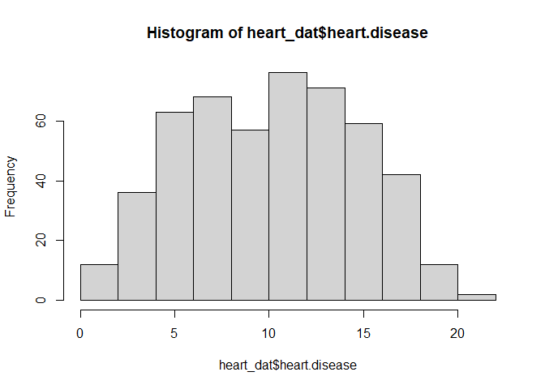<!-- -->

The distribution of observations is roughly bell-shaped, so we can proceed with the linear regression.

3. Linearity

We can check this using two scatter plots: one for biking and heart disease, and one for smoking and heart disease.


```r
plot(heart.disease ~ biking, data = heart_dat)
```

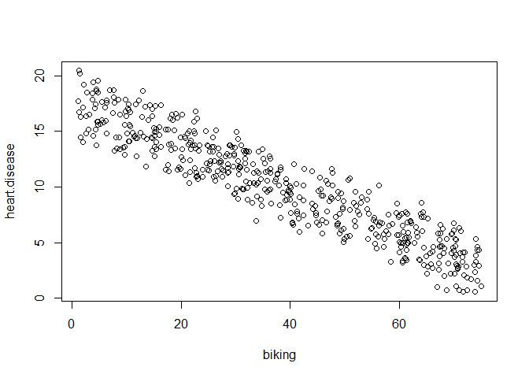<!-- -->


```r
plot(heart.disease ~ smoking , data = heart_dat)
```

<!-- -->
Although the relationship between smoking and heart disease is a bit less clear, it still appears linear. We can proceed with linear regression.

4. Homoscedasticity
We will check this after we make the model.

### Perform Multiple Linear Regression

***Multiple regression: biking, smoking, and heart disease***

Let’s see if there’s a linear relationship between biking to work, smoking, and heart disease in our imaginary survey of 500 towns. The rates of biking to work range between 1 and 75%, rates of smoking between 0.5 and 30%, and rates of heart disease between 0.5% and 20.5%.

To test the relationship, we first fit a linear model with heart disease as the dependent variable and biking and smoking as the independent variables. Run these two lines of code.


```r
heart.disease.lm <- lm(heart.disease ~ biking + smoking, data = heart_dat)

summary(heart.disease.lm)
```

```

Call:
lm(formula = heart.disease ~ biking + smoking, data = heart_dat)

Residuals:
    Min      1Q  Median      3Q     Max 
-2.1789 -0.4463  0.0362  0.4422  1.9331 

Coefficients:
             Estimate Std. Error t value Pr(>|t|)    
(Intercept) 14.984658   0.080137  186.99   <2e-16 ***
biking      -0.200133   0.001366 -146.53   <2e-16 ***
smoking      0.178334   0.003539   50.39   <2e-16 ***
---
Signif. codes:  0 '***' 0.001 '**' 0.01 '*' 0.05 '.' 0.1 ' ' 1

Residual standard error: 0.654 on 495 degrees of freedom
Multiple R-squared:  0.9796,	Adjusted R-squared:  0.9795 
F-statistic: 1.19e+04 on 2 and 495 DF,  p-value: < 2.2e-16
```

The estimated effect of biking on heart disease is -0.2, while the estimated effect of smoking is 0.178.

This means that for every 1% increase in biking to work, there is a correlated 0.2% decrease in the incidence of heart disease. Meanwhile, for every 1% increase in smoking, there is a 0.178% increase in the rate of heart disease.

The standard errors for these regression coefficients are very small, and the t statistics are very large (-147 and 50.4, respectively). The p values reflect these small errors and large t statistics. For both parameters, there is almost zero probability that this effect is due to chance.

Remember that these data are made up for this example, so in real life these relationships would not be nearly so clear!

### Check for homoscedasticity

Likewise in Simple Linear regression, we should check that our model is actually a good fit for the data, and that we don’t have large variation in the model error, by running this code.


```r
par(mfrow = c(2,2))
plot(heart.disease.lm)
```

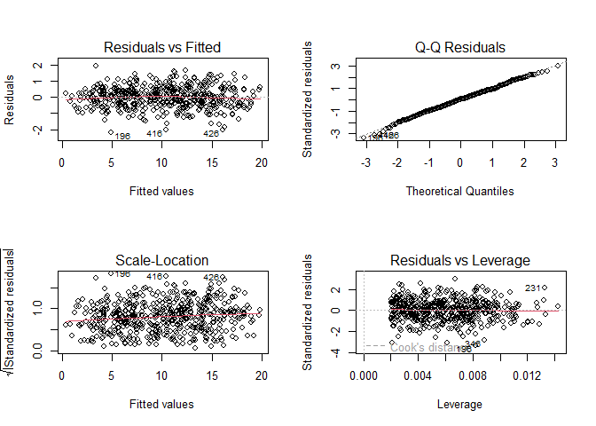<!-- -->

```r
par(mfrow = c(1,1))
```

As with our simple regression, the residuals show no bias, so we can say our model fits the assumption of homoscedasticity.

### Model Performance

We can use one package where you can access the reports of the model.

```r
#install.packages("easystats")
library(easystats)
performance(heart.disease.lm)
```

```
# Indices of model performance

AIC     |    AICc |      BIC |    R2 | R2 (adj.) |  RMSE | Sigma
----------------------------------------------------------------
995.353 | 995.435 | 1012.196 | 0.980 |     0.980 | 0.652 | 0.654
```


```r
# Report of the model
report(heart.disease.lm)
```

```
We fitted a linear model (estimated using OLS) to predict heart.disease with
biking and smoking (formula: heart.disease ~ biking + smoking). The model
explains a statistically significant and substantial proportion of variance (R2
= 0.98, F(2, 495) = 11895.24, p < .001, adj. R2 = 0.98). The model's intercept,
corresponding to biking = 0 and smoking = 0, is at 14.98 (95% CI [14.83,
15.14], t(495) = 186.99, p < .001). Within this model:

  - The effect of biking is statistically significant and negative (beta = -0.20,
95% CI [-0.20, -0.20], t(495) = -146.53, p < .001; Std. beta = -0.94, 95% CI
[-0.95, -0.93])
  - The effect of smoking is statistically significant and positive (beta = 0.18,
95% CI [0.17, 0.19], t(495) = 50.39, p < .001; Std. beta = 0.32, 95% CI [0.31,
0.34])

Standardized parameters were obtained by fitting the model on a standardized
version of the dataset. 95% Confidence Intervals (CIs) and p-values were
computed using a Wald t-distribution approximation.
```

### Visualize the results with a graph

The visualization step for multiple regression is more difficult than for simple regression, because we now have two predictors. One option is to plot a plane, but these are difficult to read and not often published.

We will try a different method: plotting the relationship between biking and heart disease at different levels of smoking. In this example, smoking will be treated as a factor with three levels, just for the purposes of displaying the relationships in our data.

**Create a new data frame with the information needed to plot model**

Use the function *expand.grid()* to create a data frame with the parameters you supply. Within this function we will:

- Create a sequence from the lowest to the highest value of your observed biking data;

- Choose the minimum, mean, and maximum values of smoking, in order to make 3 levels of smoking over which to predict rates of heart disease


```r
plotting_data <- expand.grid(
  biking = seq(min(heart_dat$biking), max(heart_dat$biking), length.out = 30),
  smoking = c(min(heart_dat$smoking),mean(heart_dat$smoking),max(heart_dat$smoking))
)
# plotting_data
```
**Predict the values of heart diseases based on your linear model**


```r
plotting_data$predicted.y <- predict.lm(heart.disease.lm, newdata = plotting_data)
```

**Round the smoking numbers to two decimals**

This makes easier to show legend afterwards. 

```r
plotting_data$smoking <- round(plotting_data$smoking, digits = 2)
```

**Change the ‘smoking’ variable into a factor**

This allows us to plot the interaction between biking and heart disease at each of the three levels of smoking we chose.


```r
plotting_data$smoking <- as.factor(plotting_data$smoking)
```

**Now plot the data**


```r
heart_plot <- ggplot(data = heart_dat,
                     mapping = aes(x = biking, y = heart.disease))+
  geom_point() + #Making simple poing grapgh
  geom_line(data = plotting_data, aes(x = biking, y = predicted.y, color = smoking), size = 1.25) + #plotting regression line 
  theme_bw() +
  labs(title = "Rates of heart disease (% of population) \n as a function of biking to work and smoking",
      x = "Biking to work (% of population)",
      y = "Heart disease (% of population)",
      color = "Smoking \n (% of population)") # making plot for publication.

heart_plot
```

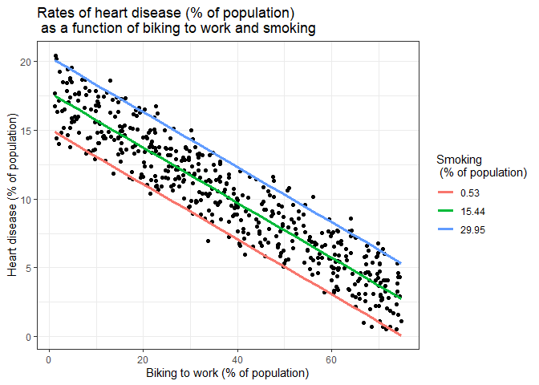<!-- -->

Because this graph has two regression coefficients, the *stat_regline_equation()* function won’t work here. But if we want to add our regression model to the graph, we can do so like this.


```r
heart_plot + annotate(geom="text", x=30, y=1.75, label="HD = 15 + (-0.2*biking) + (0.178*smoking)")
```

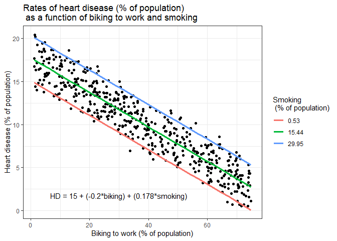<!-- -->

